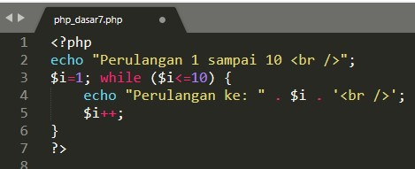

# Lab7Web
1. Menjalankan XAMPP  

 Pengertian XAMPP adalah perangkat lunak (free software) bebas, yang mendukung untuk banyak sistem operasi, yang merupakan kompilasi dari beberapa program. Fungsi XAMPP sendiri adalah sebagai server yang berdiri sendiri (localhost), yang terdiri beberapa program antara lain : Apache HTTP Server, MySQL database, dan penerjemah bahasa yang ditulis dengan bahasa pemrograman PHP dan Perl. 

2.konfigurasi Apache

 Apache adalah software web server yang gratis dan bersifat open source. Server ini telah menjadi platform bagi 46% website di seluruh dunia. Nama resminya adalah Apache HTTP Server, dan software ini dikelola dan dikembangkan oleh Apache Software Foundation. 

3. Letak direktori membuat web

4. letak direktori Mysql

5. konfigurasi Mysql

 MySQL adalah sistem manajemen database relasional open source (RDBMS) dengan client-server model. Sedangkan RDBMS merupakan software untuk membuat dan mengelola database berdasarkan pada model relasional. 

6. Membuat direktori

 Membuat folder lab7_php_dasar didalam xampp/htdocs 

7. Mengakses direktori lab7_php_dasar

8. Membuat coding PHP dasar
* input

* output

9. Membuat variabel PHP
* input

* output

10. Membuat input nama
* input

* output

11. Membuat form input
* input

* output

12. Membuat gaji (operator)
* input

* output

13. Membuat hari (Kondisi if)
* input

* output

14. Membuat hari (kondisi switch)
* input

* output

15. Membuat bilangan 1 - 10 (perulangan for)
* input

* output

16. Membuat bilangan 1 - 10 (perulangan while)
* input

* output

17. Membuat bilangan 1- 10 (perulangan dowhile)
* input

* output

# Pertanyaan dan Tugas  

 Buatlah program PHP sederhana dengan menggunakan form input yang menampilkan nama, tanggal lahir dan pekerjaan. Kemudian tampilkan outputnya dengan menghitung umur berdasarkan inputan tanggal lahir. Dan pilihan pekerjaan dengan gaji yang berbeda-beda sesuai pilihan pekerjaan. 

* input

* output

 memasukkan nama lengkap, tanggal lahir, dan pekerjaan 

 Hasil dari data diri yang di masukkan 

 
